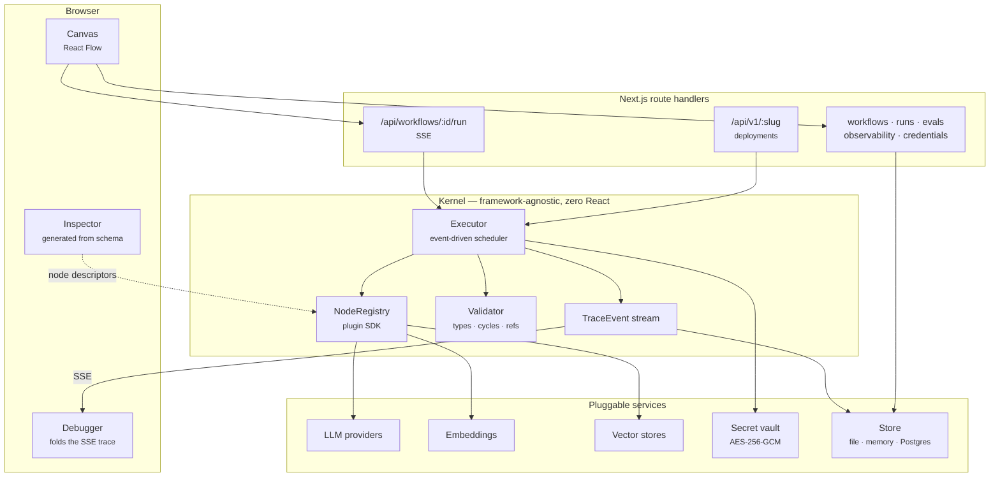

<div align="center">

# FlowForge AI

**A visual engineering platform for AI agents.**
Design, run, debug, evaluate, deploy, and observe agent workflows — on one canvas, in one app.

[](https://github.com/itsshreyasbhardwaj-design/flowforge-ai/actions/workflows/ci.yml)
[](LICENSE)
[](tsconfig.json)
[](#zero-cost-by-default)

</div>

---

## Why

Building an agent means stitching together a prompt playground, a notebook, a
vector database console, a job runner, a logging stack, and an eval script — none
of which agree on what a "run" is. The moment something misbehaves in production
you are correlating timestamps across five tools.

FlowForge collapses that loop. A workflow is a typed, versioned graph. Running it
produces a trace. The debugger, the evaluation harness, the cost dashboard, and
the deployed endpoint all read that same trace. There is exactly one
representation of what happened.

## Zero cost by default

FlowForge runs **completely offline with no API keys and no accounts**:

| Concern      | Default                                                | Swap in              |
| ------------ | ------------------------------------------------------ | -------------------- |
| Model        | `flowforge/mock` — deterministic, hash-derived replies | `OPENROUTER_API_KEY` |
| Embeddings   | Local stemmed lexical n-gram embedder                  | `OPENAI_API_KEY`     |
| Vector store | In-process exact cosine search                         | pgvector             |
| Database     | Atomic JSON file at `.flowforge/store.json`            | Postgres             |
| Secrets      | AES-256-GCM encrypted at rest                          | Any `SecretVault`    |

The mock model is deterministic — the same prompt always yields the same reply —
which is precisely what makes the evaluation harness and the test suite
reproducible. `pnpm dev` gives you a working platform in about ten seconds.

---

## Quick start

```bash
git clone https://github.com/itsshreyasbhardwaj-design/flowforge-ai.git
cd flowforge-ai
pnpm install
pnpm dev
```

Open <http://localhost:3000>, go to **Marketplace**, install _RAG Question
Answering_, and press **Run**. No configuration required.

```bash
pnpm verify   # typecheck + lint + tests + production build
```

---

## Screenshots

> Placeholders — capture from a local instance and drop into `docs/images/`.

|                                                                                                  |                                                                                        |
| ------------------------------------------------------------------------------------------------ | -------------------------------------------------------------------------------------- |
| <br/>**Canvas** — typed ports, live run status                  | <br/>**Debugger** — Gantt timeline, per-node cost |
| <br/>**Observability** — latency, spend, hotspots | <br/>**Versions** — structural diff between versions      |

---

## Architecture



### The scheduler

Execution is **event-driven**, not layer-by-layer. A node becomes runnable the
instant every inbound edge has _resolved_ — delivered a value **or** been
skipped. Independent branches therefore overlap naturally, and a slow node never
blocks a sibling.

Branching needs no special cases in the engine. A node's result simply omits the
output ports it did not activate:

```ts
// Condition node — one port fires, the other does not exist in the result.
return { outputs: matched ? { true: value } : { false: value } };
```

Edges leaving an omitted port are marked `skipped`; a node whose inbound edges
are _all_ skipped is itself skipped, transitively. That single rule implements
`if`, `switch`, guard clauses, retrieval fallbacks, and error routing — and it is
why the engine contains no branch on node type anywhere.

### Why the graph is acyclic

Cycles are rejected at validation time. Iteration is expressed by a **Loop** node
that invokes a _sub-workflow_ once per item. This costs a little authoring
convenience and buys three things: termination is guaranteed by a depth limit,
every iteration gets its own independently-inspectable trace, and the loop body is
a first-class workflow you can test, version, and reuse on its own.

### Repository layout

```
src/
  core/                    # the kernel — no React, no Next.js, no database
    graph/                 # Workflow model, port typing, validation, cycle detection
    registry/              # NodeDefinition contract + registry  ← the plugin SDK
    runtime/               # executor, trace events, expressions, secret vault
    nodes/                 # the 31 built-in nodes
    providers/             # LLM, embedding, and vector-store implementations
    eval/                  # metrics + suite runner + version comparison
    versioning/            # structural workflow diff
    telemetry/             # run aggregation for the dashboards
    assistant/             # deterministic analyzer + LLM workflow generation
    store/                 # persistence contract, memory + file adapters
    templates/             # the four bundled marketplace workflows
  app/                     # Next.js App Router — pages and route handlers
  components/              # editor, shell, and UI primitives
  server/                  # runtime singleton, API helpers, rate limiting
tests/                     # Vitest suites for the kernel
```

---

## Node library

31 nodes ship in the box. Every one is a plain `NodeDefinition` — the built-ins
use exactly the API a third-party plugin uses.

| Category         | Nodes                                                         |
| ---------------- | ------------------------------------------------------------- |
| **Triggers**     | Manual, Webhook, Schedule                                     |
| **Models**       | LLM (streaming, JSON mode, cost-accounted)                    |
| **Prompts**      | Prompt template                                               |
| **Agents**       | Agent (role-scoped, delegates to sub-workflows as tools)      |
| **Knowledge**    | Embedding, Knowledge Base, Vector Search                      |
| **Memory**       | Memory (read / append / clear)                                |
| **Logic**        | Condition, Router, Loop, Parallel, Merge, Sub-workflow, Timer |
| **Human**        | Human Approval                                                |
| **Data**         | REST API, JSON, CSV Reader, Text Splitter                     |
| **Code**         | Function (sandboxed JS), Python (external runner)             |
| **Integrations** | Webhook, Slack, Discord, GitHub, Web Search, **MCP Server**   |
| **Output**       | Output                                                        |

### Multi-agent

Multi-agent systems are expressed as agents whose **tools are other workflows**:

```jsonc
{
  "type": "flowforge.agent",
  "config": {
    "name": "Manager",
    "role": "manager",
    "tools": [
      { "name": "research", "description": "Gather sources", "workflowId": "wf_researcher" },
      { "name": "review", "description": "Critique a draft", "workflowId": "wf_reviewer" },
    ],
  },
}
```

Delegation reuses the same executor, tracing, cost accounting, and depth limit as
everything else — there is no parallel code path for "agent mode". Each
specialist stays independently runnable, testable, and versionable.

---

## Workflow examples

### Retrieval with an explicit failure branch

The bundled _RAG Question Answering_ template wires retrieval's `empty` port to a
fallback, so the workflow says "I don't know" instead of letting the model answer
from nothing:

```
Trigger ─┬─ Pick documents ─ Index ─┐
         └─ Pick question ──────────┴─ Retrieve ─┬─(documents)─ LLM ──────┐
                                                 └─(no matches)─ Fallback ─┴─ Merge ─ Output
```

### Expressions

Any config value can reference the run scope:

```
{{ $.input.question }}
{{ $.nodes.retrieve.output.documents[0].text }}
{{ $.vars.tone ?? "neutral" }}
```

A template that is _exactly one_ expression yields the raw value — objects and
arrays survive. Mixed text interpolates. This is a path resolver, not an
evaluator: there is no `eval` anywhere in the expression engine.

---

## Plugin development

A node is a self-describing object. Everything the UI shows — the inspector form,
the port handles, validation, docs — is derived from it, so a third-party node is
indistinguishable from a built-in.

```ts
import { z } from 'zod';
import { defineNode } from '@/core/registry/definition';

export const sentimentNode = defineNode({
  type: 'acme.sentiment',
  version: '1.0.0',
  label: 'Sentiment',
  description: 'Score text from -1 (negative) to 1 (positive).',
  category: 'data',
  icon: 'Sparkles',

  configSchema: z.object({
    threshold: z.number().min(-1).max(1).default(0),
  }),
  configUi: {
    threshold: { widget: 'number', order: 1, help: 'Boundary between negative and positive.' },
  },

  inputs: [{ id: 'text', label: 'Text', type: 'string', required: true }],
  outputs: [
    { id: 'score', label: 'Score', type: 'number' },
    { id: 'positive', label: 'Positive', type: 'string', conditional: true },
    { id: 'negative', label: 'Negative', type: 'string', conditional: true },
  ],
  capabilities: { deterministic: true },

  async execute({ config, inputs, ctx }) {
    const response = await ctx.providers.llm().complete({
      model: 'flowforge/mock',
      messages: [{ role: 'user', content: `Score the sentiment of: ${inputs.text}` }],
      jsonMode: true,
    });
    ctx.reportUsage(response.usage);

    const score = Number(JSON.parse(response.text).score ?? 0);
    return {
      outputs: {
        score,
        // Omitting a port skips everything downstream of it.
        ...(score >= config.threshold ? { positive: inputs.text } : { negative: inputs.text }),
      },
    };
  },
});
```

Register it:

```ts
registry.use({
  name: 'acme-nodes',
  version: '1.0.0',
  nodes: [sentimentNode],
});
```

`TConfig` is inferred from `configSchema`, so `execute` receives fully-typed
configuration with no casts. The full contract — `NodeContext`, providers,
secrets, sub-workflow invocation, custom LLM/embedding/vector backends — is in
[docs/plugins.md](docs/plugins.md).

---

## Evaluation

Define a suite of cases, run it against a version, then compare versions:

```bash
curl -X POST localhost:3000/api/evals -H 'Content-Type: application/json' -d '{
  "action": "createSuite",
  "workflowId": "wf_abc",
  "name": "Refund policy accuracy",
  "metrics": ["taskCompletion", "tokenF1", "latencyMs", "costUsd"],
  "cases": [
    { "input": { "question": "What is the refund window?" }, "expected": "30 days" }
  ]
}'
```

Built-in metrics: exact match, contains, token F1, task completion, reasoning
depth, latency, cost, tokens. Custom metrics are one object.

A case **passes** when every _quality_ metric clears 0.5. Cost and latency are
reported but never gate a pass — a slow correct answer is still correct, and
conflating the two hides real regressions. Version comparison reports which cases
flipped in each direction.

---

## Deployment

Publishing freezes the draft and opens a new one. A deployment is pinned to the
version it was created from, so publishing again can never change a live
endpoint's behaviour.

| Kind       | Shape                          |
| ---------- | ------------------------------ |
| `rest`     | `POST /api/v1/:slug` → JSON    |
| `webhook`  | Accepts third-party deliveries |
| `schedule` | Cron-triggered                 |
| `worker`   | Drained by a background worker |
| `chat`     | Conversational endpoint        |
| `cli`      | Called from a terminal         |
| `widget`   | Embedded via iframe            |

```bash
curl -X POST https://your-app/api/v1/support-triage-a1b2c3 \
  -H "Authorization: Bearer $FLOWFORGE_TOKEN" \
  -H "Content-Type: application/json" \
  -d '{"question": "Where is my order?"}'
```

Tokens are shown exactly once at creation and stored only as a SHA-256 hash,
compared in constant time. Full guide: [docs/deployment.md](docs/deployment.md).

---

## API

| Method                 | Path                                | Purpose                                |
| ---------------------- | ----------------------------------- | -------------------------------------- |
| `GET`                  | `/api/nodes`                        | Node catalogue + providers             |
| `GET` `POST`           | `/api/workflows`                    | List / create                          |
| `GET` `PATCH` `DELETE` | `/api/workflows/:id`                | Read / save draft / delete             |
| `POST`                 | `/api/workflows/:id/run`            | Execute — SSE trace stream             |
| `GET` `POST`           | `/api/workflows/:id/versions`       | History / publish / rollback           |
| `GET`                  | `/api/workflows/:id/diff?from=&to=` | Structural diff                        |
| `GET` `POST`           | `/api/workflows/:id/analyze`        | Review / apply auto-fixes              |
| `GET`                  | `/api/runs`, `/api/runs/:id`        | Run list and full trace                |
| `POST`                 | `/api/runs/:id/approvals`           | Record a human decision                |
| `GET`                  | `/api/observability`                | Aggregated metrics                     |
| `GET` `POST`           | `/api/deployments`                  | List / create                          |
| `POST` `GET`           | `/api/v1/:slug`                     | **Public** execution endpoint          |
| `GET` `POST`           | `/api/evals`                        | Suites, runs, comparisons              |
| `GET` `POST` `DELETE`  | `/api/credentials`                  | Encrypted secrets (write-only)         |
| `POST`                 | `/api/assistant/generate`           | Generate a workflow from a description |

Full reference: [docs/api.md](docs/api.md).

---

## Security

- **Secrets** never enter a workflow document. Config holds `{ "$secret": "KEY" }`
  references resolved at execution time, and resolved values are tracked and
  stripped from inputs, outputs, and logs before anything is persisted or streamed.
- **Encryption at rest** with AES-256-GCM, key derived via scrypt.
- **Deployment auth** by SHA-256 token hash with constant-time comparison.
- **Rate limiting** per deployment and per client on every execution route.
- **Error responses** are opaque; internal messages and stack traces stay server-side.
- **Code nodes** run in a fresh V8 context with no `require` and a hard timeout.
  This is _isolation, not a security boundary_ — `node:vm` shares a heap with the
  host. Multi-tenant deployments must move it to a separate process. The Python
  node ships with **no** bundled runner for the same reason.

Details and the threat model: [docs/security.md](docs/security.md).
Report vulnerabilities per [SECURITY.md](SECURITY.md).

---

## Performance

- Independent branches execute concurrently, bounded by a per-workflow cap.
- Traces are size-capped per value so one huge payload cannot blow up a run record.
- Bounded worker pools in Loop and the eval runner — iterations are not all
  materialised up front.
- Barrel imports are optimised so only referenced icons reach the client bundle.
- Client-side validation is pure and runs on every edit, with no network round trip.
- Vector search is exact brute force, which is genuinely the right call below
  ~50k vectors: no index build, no recall loss, no dependency.

---

## Roadmap

| Status | Item                                                                                                                                                                                                         |
| ------ | ------------------------------------------------------------------------------------------------------------------------------------------------------------------------------------------------------------ |
| ✅     | Execution engine, plugin SDK, 31 nodes, canvas, debugger, versioning + diff, evaluation, observability, REST/webhook deployment, encrypted credentials, marketplace, MCP client node                         |
| 🚧     | Postgres store adapter; run-resume from a suspended approval; Playwright E2E coverage                                                                                                                        |
| 📋     | Collaborative multiplayer editing; scheduled-trigger worker; plugin registry + `npx flowforge add`; pgvector and Qdrant adapters; LLM-as-judge eval metrics; FlowForge as an _MCP server_, not just a client |

Marketplace ratings and download counts are currently local-only — there is no
hosted registry behind them yet.

---

## Contributing

Contributions are welcome. Start with [CONTRIBUTING.md](CONTRIBUTING.md).

```bash
pnpm install
pnpm test:watch
pnpm verify      # must pass before opening a PR
```

The kernel under `src/core/` has no React and no Next.js imports. Keep it that
way — it is what makes the engine testable and embeddable.

## License

[MIT](LICENSE)
